<!-- Generated by GitHub Profile Agent Console. Edit profile.config.json, then run npm run generate. -->

  <picture>
    <source media="(max-width: 760px) and (prefers-color-scheme: dark)" srcset="./assets/hero/agent-console-d8b6637b-mobile-dark.svg">
    <source media="(max-width: 760px)" srcset="./assets/hero/agent-console-d8b6637b-mobile-light.svg">
    <source media="(prefers-color-scheme: dark)" srcset="./assets/hero/agent-console-d8b6637b-dark.svg">
    <source media="(prefers-color-scheme: light)" srcset="./assets/hero/agent-console-d8b6637b-light.svg">
    
  </picture>

  

## About Me

I build frontend and backend systems for AI applications, focusing on turning model capabilities into real, usable products.

My work spans AI automations, agentic workflows, and retrieval-based systems, from user-facing interfaces to the pipelines that power them.

## Current Focus

| Area | What I am exploring |
| --- | --- |
| **Frontend AI Apps** | Building responsive, production-ready interfaces for AI-powered products with React and Next.js. |
| **Backend AI Systems** | Designing APIs, data pipelines, and automation logic that power reliable AI applications. |
| **AI Automations** | Building agentic workflows and automation pipelines that connect models, tools, and data. |

## Featured Work

| Project | Focus | Why it matters |
| --- | --- | --- |
| [**MenuKita**](https://github.com/wildanniam/menu-kita) | Mixed-diet group dining | Scans restaurant menus and checks each dish against every diner's food profile, flagging what works, what conflicts, and generating translated questions to ask the restaurant. |
| [**3D Website**](https://github.com/MominaAli1/3dWebsite) | Three.js animation practice | A demo site built with Three.js featuring a 3D donut animation, built to practice animation techniques for the web. |
| [**RAG Pipeline**](https://github.com/MominaAli1/RAG) | Local retrieval-augmented generation | A fully local RAG pipeline in Python: extracts PDF text, chunks and embeds it, stores vectors in ChromaDB, and generates grounded answers using Groq's LLaMA 3. |

## Research Direction

I'm interested in building AI systems end-to-end: interfaces people actually use, automations that remove repetitive work, and retrieval pipelines that ground model outputs in real data.

## Tech Stack

`React` · `Next.js` · `TypeScript` · `JavaScript` · `Three.js` · `Python` 

## Recent Activity

<!-- AUTO:ACTIVITY:START -->
- Sep 3, 2026: created a branch in [MominaAli1/solari-cookbook](https://github.com/MominaAli1/solari-cookbook).
- Aug 25, 2026: pushed 1 commit to [MominaAli1/3dWebsite](https://github.com/MominaAli1/3dWebsite).
- Aug 25, 2026: created a branch in [MominaAli1/3dWebsite](https://github.com/MominaAli1/3dWebsite).
- Aug 25, 2026: pushed 1 commit to [MominaAli1/MominaAli1](https://github.com/MominaAli1/MominaAli1).
- Aug 25, 2026: opened pull request [#5](https://github.com/MominaAli1/3dWebsite) in [MominaAli1/3dWebsite](https://github.com/MominaAli1/3dWebsite).
- Aug 10, 2026: closed pull request [#4](https://github.com/MominaAli1/3dWebsite) in [MominaAli1/3dWebsite](https://github.com/MominaAli1/3dWebsite).
<!-- AUTO:ACTIVITY:END -->

---

  Building AI products end-to-end.

